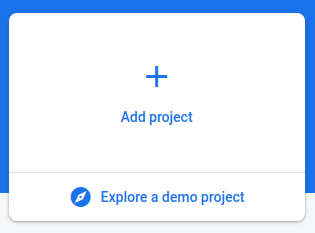
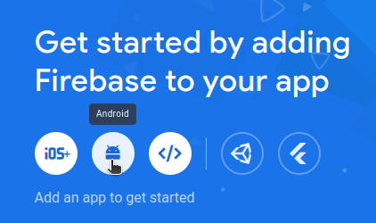

# Fila Magenta App

The official app for managing filà's stuff on Android devices.

[![Dokka][documentation-badge]][documentation-url]
[![GitHub issues][issues-badge]][issues-url]
[![GitHub Pull Requests][pulls-badge]][pulls-url]

# Firebase Project Setup

Firebase is required for push notifications to work. You can configure it as follows:

1. [Create](https://console.firebase.google.com/) a new Firebase project.\
   
2. Choose a name for the project.
3. Choose whether to enable Google Analytics or not.
4. Choose the account to use for Google analytics (if any).
5. Add a new Android App.\
   
6. Complete the required parameters.
    1. You can get the [debug certificate][android-docs-cert] with:
       ```shell
       keytool -list -v -alias androiddebugkey -keystore ~/.android/debug.keystore
       ```
       Note that the default password is `android`.
    2. Download the `google-services.json` file and store it into [`app`](./app).
7. You should now be ready.

[documentation-url]: https://filamagenta.github.io/Android/

[documentation-badge]: https://img.shields.io/static/v1?label=Dokka&message=Reference&color=success&logo=kotlin&style=for-the-badge

[issues-url]: https://github.com/FilaMagenta/Android/issues

[issues-badge]: https://img.shields.io/github/issues/FilaMagenta/Android?style=for-the-badge

[pulls-url]: https://github.com/FilaMagenta/Android/pulls

[pulls-badge]: https://img.shields.io/github/issues-pr/FilaMagenta/Android?style=for-the-badge

[android-docs-cert]: https://developers.google.com/android/guides/client-auth#using_keytool_on_the_certificate
